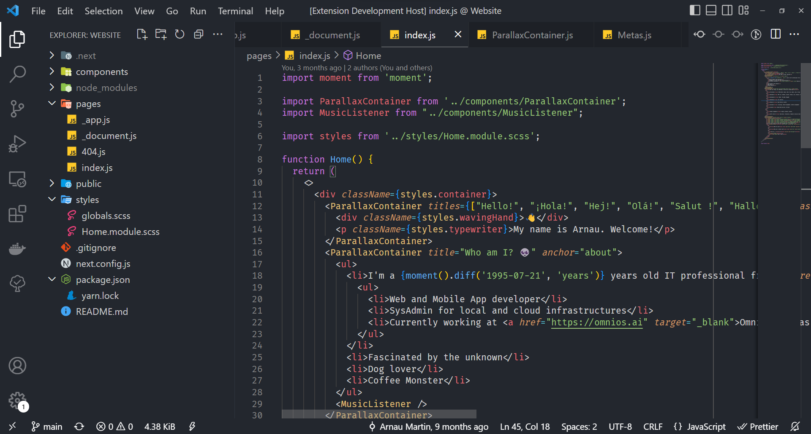

# Functional Dark Theme

This is a simple dark theme with few colors popping up, preventing distractions.

This theme will work on VSCode / VSCodium / any fork of Visual Studio Code (VSCode from now on).

## Why use this theme

I often find myself looking constantly for themes that are not distracting and are yet powerful enough to let me do my job. As a neurodivergent person this helps me focus and doesn't make me feel as nervous or anxious.

## Screenshots

Icon pack: Material Icons

## Contributing

I'm open to checking PRs and testing them myself. If I find your changes to be good, they will be included and you'll be mentioned in this Readme.

## Developing this theme

Download the repo, open it with VSCode , and go tpco Debug > Start debugging. This will open a new instance of VSCode with the theme applied.
